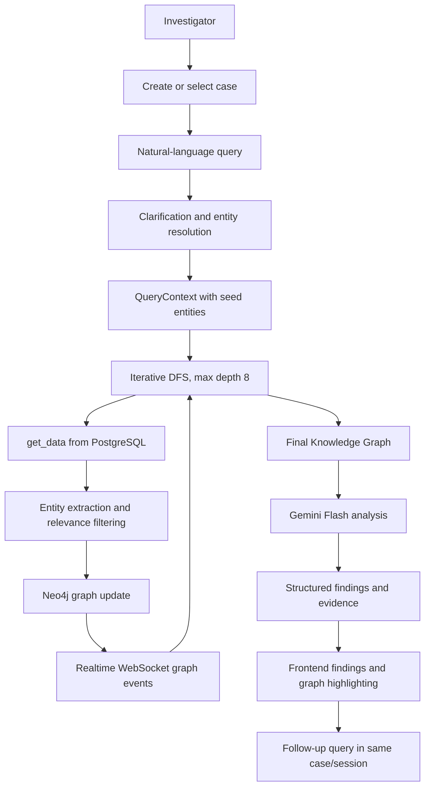

# AI-Powered Investigation & Criminal Network Analysis System
Smart India Hackathon 2026 - Problem Statement 26189

## 1. Problem Statement

Investigative data is fragmented across authorized sources such as case records, communications, vehicles, locations, transactions, events, and evidence records. Relationships between these entities are difficult to discover manually, especially when investigators need to follow several degrees of connection.

Investigators need a focused system that can explore these relationships, show how entities are connected, and surface relevant investigative leads with traceable supporting evidence. This system supports investigation; it does not determine legal guilt.

## 2. Solution

The prototype provides:

- A case-based investigation workspace
- Natural-language investigator queries
- Query clarification and database-backed entity resolution
- Depth-limited recursive investigation of related entities
- Neo4j Knowledge Graph construction
- Realtime graph visualization during traversal
- AI-assisted final pattern and connection analysis
- Evidence-backed structured findings with confidence
- Finding-to-graph path highlighting
- Stateful follow-up investigation within the same case and session
- Persistent investigation conversations and results in PostgreSQL

The system identifies possible connections, relevant relationships, suspicious patterns, and investigative leads. It does not make legal determinations or claim that a person is guilty.

## 3. End-to-End Investigation Workflow



1. An investigator creates or selects a persisted case.
2. The investigator submits a natural-language query.
3. The backend validates the case and resolves mentioned entities from PostgreSQL. Ambiguous or incomplete queries request clarification.
4. A `QueryContext` preserves the case, original query, clarified query, resolved seed entities, target entities where available, and maximum depth.
5. DFS initializes its stack with resolved query entities, not with the case itself.
6. `get_data()` retrieves authorized structured data from PostgreSQL.
7. Entity extraction, resolution, and relevance filtering produce graph nodes, relationships, evidence references, and traversal candidates.
8. Entities and relationships are persisted to Neo4j. Node and edge events are streamed immediately to the frontend.
9. Traversal continues until the stack is empty or maximum depth 8 is reached.
10. The completed Knowledge Graph is retrieved and analyzed once by Gemini using the investigator's query and graph context.
11. Structured findings are persisted and sent to the frontend.
12. Investigators can select findings to highlight exact graph paths and submit follow-up queries using the same case, session, and graph.

Final AI pattern detection runs after recursive traversal, not during every DFS iteration.

## 4. Recursive Investigation / DFS

The existing investigation engine uses an iterative depth-first search:

- The stack starts with entity IDs resolved from the query context.
- One entity is processed at a time.
- `get_data()` retrieves the entity and its known relationships.
- Entity services extract relevant entities, relationships, evidence, and candidates.
- The graph service adds nodes and relationships to Neo4j.
- Relevant undiscovered entities are pushed onto the stack.
- Visited entity IDs prevent repeated processing and cycles.
- Invalid or missing entities are completed without retry loops.
- Entities at depth 8 can be processed and persisted but are not expanded.
- Traversal ends when the stack is empty or the configured maximum depth is reached.

The original and clarified query context remains available throughout traversal. DFS does not ask Gemini to choose the next entity and does not rewrite the investigation goal while exploring.

## 5. Knowledge Graph

Neo4j stores the investigation graph as stable entity nodes and relationship edges. A graph may connect records such as:

```text
Person -> Phone -> Person -> Transaction -> Person
       -> Vehicle -> Location -> Case/Event
```

Relationships preserve metadata such as relationship type, confidence, source record ID, status, and validity timestamps where available. The graph is progressively constructed during DFS and streamed to the frontend, allowing investigators to watch the network develop instead of waiting for the final result.

## 6. AI Pattern Detection

Gemini Flash is used once, after DFS has completed and the final Knowledge Graph is available.

```text
Original query
+ Clarified query
+ Completed Knowledge Graph
+ Available evidence and source context
                    |
                    v
             Gemini Flash
                    |
                    v
       Structured investigation findings
```

The Gemini request requires structured JSON findings containing titles, concise explanations, graph entity IDs, relationship IDs, confidence, and evidence references. The backend validates returned IDs against the graph and uses a graph-only fallback if Gemini is unavailable or fails.

Gemini does not control DFS, invent entities or relationships, replace PostgreSQL or Neo4j, or determine whether a person is legally guilty.

## 7. Investigation Findings

Findings appear in the Investigation Chat as compact expandable cards. A finding can contain:

- A short title and summary
- A cautious AI-generated explanation
- Confidence
- Stable entity IDs and relationship IDs
- Supporting source records and evidence descriptions

Selecting a finding highlights its exact graph nodes and edges using stable IDs and dims unrelated graph elements. **Clear Highlight** restores the complete graph without refetching or rebuilding it.

## 8. Investigation Chat + Graph Experience

The existing workspace supports the following interaction:

```text
Investigation Chat
        |
        v submit query
Network Graph with live DFS updates
        |
        v findings-ready and investigation-completed
Investigation Chat with appended findings
        |
        v follow-up query
Same case, session, conversation, and cumulative graph
```

```text
┌─────────────────────────────────────────────┐
│ Investigation Chat                          │
│                                             │
│ Investigator: How is Rahul connected...?   │
│                                             │
│ System: Investigation started...            │
│                                             │
│ ┌──────────────────────┐ ┌───────────────┐  │
│ │   LIVE KNOWLEDGE     │ │ Findings      │  │
│ │       GRAPH          │ │ 1. Rahul -> X │  │
│ │                      │ │ 2. X -> Amit  │  │
│ └──────────────────────┘ └───────────────┘  │
│                                             │
│ System: Investigation completed             │
│                                             │
│ Ask a follow-up...                          │
└─────────────────────────────────────────────┘
```

Submitting a query moves the workspace to Network Graph while the existing chat remains mounted and the WebSocket stays active. After final findings and completion arrive, the workspace returns to Investigation Chat. Previous queries, responses, and findings remain visible and are restored from PostgreSQL when the conversation is reopened.

## 9. Data Layer

### PostgreSQL

PostgreSQL is the primary structured data store for:

- Entities and persons
- Phones and call detail records
- Transactions
- Vehicles
- Locations
- Cases and events
- Entity relationships
- Evidence and source records
- Investigation sessions, messages, runs, and findings

### Neo4j

Neo4j stores the investigation Knowledge Graph, including graph nodes, relationships, traversal discoveries, and graph metadata used for final analysis.

The demonstration uses synthetic investigation data. PostgreSQL and Neo4j are real persistence layers in the prototype, not mock databases.

## 10. Backend Architecture

The backend is a Python FastAPI application. Its responsibilities are separated as follows:

| Layer | Responsibility |
| --- | --- |
| FastAPI | HTTP/WebSocket orchestration and session lifecycle |
| Data repository | Parameterized PostgreSQL retrieval and persistence |
| `get_data()` | Retrieves authorized data associated with one entity |
| Entity service | Normalizes entities, relationships, evidence, and traversal candidates |
| DFS service | Iterative, depth-limited traversal with cycle protection |
| Graph service | Parameterized Neo4j node and relationship upserts |
| Pattern service | One final Gemini analysis over the completed graph |
| Schemas/models | Typed API and data contracts |
| Utilities | Database, Neo4j driver, and environment configuration |

The architectural separation is:

```text
PostgreSQL -> structured data retrieval
DFS -> investigation traversal
Neo4j -> Knowledge Graph representation
Gemini -> final pattern interpretation
FastAPI -> orchestration and realtime API
Frontend -> investigator interaction and visualization
```

## 11. Frontend

The React/Vite frontend includes:

- Case directory and case workspace
- Investigation Chat
- Realtime Network Graph using `@xyflow/react`
- Findings and pattern presentation
- Timeline and evidence views
- Case status and workspace overview
- Progressive node and edge updates from WebSocket events
- Stable finding-to-graph highlighting and Clear Highlight behavior
- Follow-up investigation in the same session
- Persistent conversation restoration through the backend history endpoint

The existing `mockData.js` provides the initial synthetic dashboard/dossier presentation. Live investigation queries, graph updates, findings, case creation, and conversation persistence use the FastAPI backend.

## 12. Security / Data Principles

- Only authorized investigation data should be used.
- Synthetic data is used for this SIH prototype.
- Database credentials and API keys remain in environment configuration and must not be exposed to the frontend or committed to source control.
- Backend queries use parameterized SQL and parameterized Neo4j queries; arbitrary Cypher is not accepted from the frontend.
- Source records and evidence references remain traceable where available.
- The system provides investigative intelligence and relationship analysis, not a legal determination of guilt.

## 13. Example Investigation

Using the synthetic demonstration data, an investigator might ask:

```text
How is Rahul Sharma connected to Operation Blackout?
```

The system resolves the mentioned person from PostgreSQL, creates a case-scoped `QueryContext`, and starts DFS from that person rather than treating the case as the seed:

```text
Rahul Sharma
      |
      v
Phone / communication relationship
      |
      v
Related person or other resolved entity
      |
      v
Financial, vehicle, location, case, or event relationships
```

DFS explores the relevant network, Neo4j builds the graph progressively, and Gemini analyzes the completed graph in the context of the investigator's question to produce structured investigative findings. The example is based on the repository's synthetic records; the system does not invent missing relationships.

## 14. Current Technology Stack

### Frontend

- React
- Vite
- Tailwind CSS
- `@xyflow/react`
- Recharts
- Lucide React

### Backend

- Python
- FastAPI
- psycopg2

### Data

- PostgreSQL
- Neo4j Python driver

### AI

- Gemini API, using Gemini Flash for final structured pattern analysis

## 15. Project Status

The project is a working SIH prototype with the following capabilities implemented:

- Live FastAPI investigation flow
- PostgreSQL structured data retrieval and conversation persistence
- Generic persisted case creation
- Query clarification and database-backed entity resolution
- Iterative DFS traversal with maximum depth 8 and cycle protection
- Neo4j graph construction
- Realtime WebSocket graph visualization
- Final Gemini-based pattern analysis with safe graph-only fallback
- Structured investigation findings with evidence and confidence
- Interactive finding/path highlighting and Clear Highlight
- Follow-up queries using the same case, session, conversation, and cumulative graph
- Timeline, evidence, patterns, dashboard, and case workspace views

Current incomplete or environment-dependent areas:

- The live demonstration requires valid Neo4j credentials and a reachable Neo4j instance.
- Gemini-backed analysis requires `GEMINI_API_KEY`; without it, the graph-only fallback is used.
- The frontend case directory still uses its local synthetic dossier list for initial presentation; backend case persistence is available through the API, but a full backend case-list hydration workflow is not yet implemented.
- Authentication is currently a frontend prototype gate rather than production identity and access management.

## 16. Important Prototype Limitation

The current demonstration uses synthetic investigation data. The architecture is designed around authorized investigative data sources, but integration with real government, police, telecom, or financial systems would require appropriate authorization, secure interfaces, access controls, auditing, data governance, and deployment infrastructure.

This prototype is an investigation support system. Its findings represent possible connections, relevant relationships, and investigative leads supported by available data; they are not determinations of criminal responsibility or legal guilt.
