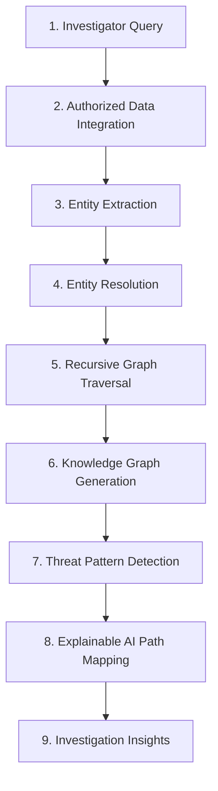
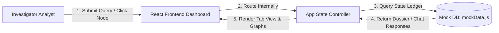

# AI-Powered Investigation & Criminal Network Analysis System
### Smart India Hackathon (SIH) 2026 – Problem Statement 26189

An advanced network analysis dashboard designed for law-enforcement and investigative analysts to trace, visualize, and query criminal syndicate connections.

---

## 1. Project Overview
Investigate AI solves the critical challenge of manual dossier analysis in criminal investigations. In traditional workflows, linking phone burner lines, vehicle plate numbers, coordinated cell tower coordinates, and bank transactions is highly fragmented. 

This system aggregates data across cases, resolves identical entities (Entity Resolution), and models relationships as a **Knowledge Graph**. By providing a conversational query interface alongside interactive React Flow graphs, it enables investigators to immediately uncover hidden syndicates and see the **evidence and confidence** behind every connection.

---

## 2. How the System Works
The operational pipeline represents the end-to-end flow of raw data to actionable intelligence:



1.  **Investigator Query**: The investigator enters a query (e.g., *"How is Rahul connected to Amit?"*).
2.  **Authorized Data Integration**: The system pulls structured/unstructured files (CDRs, FIRs, GPS logs, bank audits).
3.  **Entity Extraction**: Identifies key entities: Persons, Phone Numbers, Vehicles, and Coordinates.
4.  **Entity Resolution**: Collates multiple duplicate or fake identities belonging to the same suspect.
5.  **Recursive Graph Traversal**: Traverses node connections dynamically across multiple degrees of separation.
6.  **Knowledge Graph**: Builds a visual, multi-node network illustrating links.
7.  **Pattern & Anomaly Detection**: Highlights suspicious behaviors (e.g., call/location co-location overlaps).
8.  **Explainable AI**: Draws the exact, step-by-step path showing *why* a connection exists, rather than just asserting it.
9.  **Investigation Insights**: Delivers verified evidence attachments and confidence percentages.

---

## 3. Core Features
*   **Case-wise Investigation Workspace**: Dedicated workspace per case containing Overview, Chat, Graph, Patterns, Timeline, and Evidence views.
*   **Investigator-Driven Conversational Queries**: Ask relationship-centric questions and receive prompt, detailed paths.
*   **Interactive React Flow Graph**: Drag, zoom, and select custom nodes (Suspects, Phones, Vehicles, Locations) to pull up side dossiers.
*   **Stateful "Mark as Solved" Action**: Update case status reactively across the app workspace, directory table, and dashboard cards.
*   **Suspicious Pattern Highlighting**: Automatically alerts on critical co-location and offshore bank ledger transactions.
*   **Evidence Decryption Inspector**: Review cataloged documents and mock decrypt/download files.

---

## 4. Important Concept: Explainable Connections
Traditional systems simply tell the investigator:
> "Rahul Sharma is connected to Amit Verma."

This system rejects unexplained assertions. Instead, it traces and visualizes the **exact route**:

```
[Rahul Sharma (Suspect)] 
       ↓ (Owns)
[98XXXXXX12 (Airtel SIM)] 
       ↓ (Called 14 times)
[87XXXXXX09 (Burner Jio SIM)] 
       ↓ (Owns)
[Amit Verma (Associate)]
```
*   **Confidence**: `91%`
*   **Supporting Evidence**: Call details record `CDR-1023` (14 Aug 2026, 10:42 PM) and coordinate site overlaps `GPS-1023`.

---

## 5. Tech Stack
The project currently uses the following technologies:

| Layer | Technology | Details |
| :--- | :--- | :--- |
| **Frontend Core** | React 19, JavaScript (ES6+), Vite | High-performance client framework and bundler. |
| **Styling** | Tailwind CSS v4, PostCSS | Custom corporate slate-light styling variables. |
| **Visualization** | `@xyflow/react` (React Flow v12) | Interactive network mapping with custom node handles. |
| **Charts** | Recharts | Radial threat risk meters and connection velocity trends. |
| **Icons** | Lucide React | Clean, scalable vector indicators. |
| **Backend Core** | Python (Skeletal Structure) | Initial empty directory package structure. |

---

## 6. System Architecture



---

## 7. Project Structure

```bash
CrimeGraph AI/
├── backend/                  # Python Backend scaffolding (API entry points)
│   ├── src/
│   │   ├── models/           # Empty __init__.py placeholders for schemas
│   │   ├── routes/           # Empty __init__.py placeholders for API endpoints
│   │   ├── schema/           # Empty __init__.py placeholders for models
│   │   └── services/         # Empty __init__.py placeholders for processing scripts
│   ├── .env                  # Empty environment settings file
│   ├── .gitignore            # Backend ignore configurations
│   └── main.py               # Empty server entry point file
├── frontend/                 # React Frontend Workspace
│   ├── src/
│   │   ├── components/
│   │   │   ├── Sidebar.jsx   # simplified menu navigation
│   │   │   └── Topbar.jsx    # User profile popover panel (Agent Mayuri)
│   │   ├── data/
│   │   │   └── mockData.js   # Mock Database (Node lists, pre-computed paths)
│   │   ├── pages/
│   │   │   ├── Login.jsx           # Split-screen gateway form
│   │   │   ├── Dashboard.jsx       # Global statistics and quick access folders
│   │   │   ├── Cases.jsx           # Folders directory list & case-creator modal
│   │   │   ├── CaseWorkspace.jsx   # Case wrapper (renders Overview and tabs)
│   │   │   ├── Investigation.jsx   # AI query panel (Connection chain diagrams)
│   │   │   ├── NetworkGraph.jsx    # React Flow canvas & dossier drawers
│   │   │   ├── PatternAnalysis.jsx # Threat vector grid logs
│   │   │   ├── Timeline.jsx        # Chronological vertical tracking feeds
│   │   │   ├── Evidence.jsx        # Document vault & decryption modals
│   │   │   └── Settings.jsx        # Basic system configurations
│   │   ├── App.jsx           # Login gates, routing logs, central states
│   │   ├── index.css         # Tailwind v4 slate color tokens
│   │   └── main.jsx          # React DOM mounting
│   ├── package.json          # Frontend packages
│   └── vite.config.js        # Vite compiler rules
└── README.md                 # Global developer manual
```

---

## 8. Data Flow
1.  **Selection**: The user logs in and selects a case (e.g. `CASE-2026-001`) from the directory.
2.  **State Loading**: `App.jsx` loads the specific case object from `mockData.js` and propagates the `caseData` state to all components.
3.  **UI Propagation**:
    *   `NetworkGraph.jsx` receives the active `nodes` and `edges` and builds the React Flow canvas.
    *   `Investigation.jsx` loads the `chatResponses` map to filter and evaluate user inputs.
    *   `Timeline.jsx` and `Evidence.jsx` map out case-specific logs and file lists.
4.  **Updates**: Clicking "Mark as Solved" triggers a callback to `App.jsx` which updates the states in `cases` and `casesFullData`, propagating the change back to the Dashboard list and Cases table.

---

## 9. Database / Data Storage
No live database server is currently connected:
*   **Client Data Layer**: All dossiers are managed inside [`frontend/src/data/mockData.js`](file:///c:/Users/mayur/OneDrive/Desktop/programming/CrimeGraph%20AI/frontend/src/data/mockData.js) as structured JavaScript objects.
*   **State Management**: React `useState` hooks manage cases, active dossiers, active directories, and chat message feeds during the current session (resets on page refresh).

---

## 10. API / Backend
No active API routes are implemented yet:
*   **Backend Status**: The `backend/` folder represents a Python skeletal package structure. `main.py` is empty and serves as a placeholder.
*   **Mock Integration**: The React frontend mocks API endpoints internally by using local key-lookup methods inside the data folder.

---

## 11. Frontend Architecture
The frontend features three core components:
1.  **Investigator Portal (Login)**: Secure gateway ensuring only authorized users bypass to the dashboard.
2.  **Dashboard Grid**: Displays cross-case summaries, Recharts trends, and quick-access folders.
3.  **Case Workspace**: Centralizes analytical operations under one window, avoiding scattered sidebar pages and keeping all data scoped strictly to the selected case.

---

## 12. AI / ML Implementation
No live neural models or machine learning servers are integrated:
*   **Mock AI Query Engine**: Chat response mapping runs client-side. The system cleanses the investigator's string query and evaluates matches against keys inside the case dossier's pre-computed path array `chatResponses`.
*   **Failsafe**: If no keyword matching can be resolved, a *"Need more information"* advisory block is rendered.

---

## 13. Setup & Installation

Follow these steps to run the complete project locally.

### Prerequisites
*   [Node.js](https://nodejs.org/) (v18 or higher recommended)
*   [Python 3](https://www.python.org/)

### Step 1: Clone the Repository
```bash
git clone https://github.com/ParthDhengle/SIH-2026-26189.git
cd SIH-2026-26189
```

### Step 2: Configure & Start Frontend
```bash
# Navigate to the frontend directory
cd frontend

# Install packages
npm install

# Run the local development server
npm run dev
```
*The local dashboard will run on **`http://localhost:5173`**.*

### Step 3: Run Backend Entry Point (Scaffold Only)
```bash
# Navigate to the backend directory
cd ../backend

# Run the python entry point
python main.py
```
*(Note: As the backend is a placeholder skeleton, running main.py will exit immediately).*

---

## 14. Environment Variables
*   An empty `.env` configuration file exists in the `backend/` folder.
*   **Security Notice**: Do not commit actual passwords or private tokens to this file. In production, this file will store database credentials and cryptographic tokens.

---

## 15. Demo & Test Data
The application includes pre-loaded, synthetic mock data inside the folder mapping:
1.  **CASE-2026-001 (Operation Blackout)**: Smuggling syndicate logs involving *Rahul Sharma* (Primary POI), *Amit Verma*, *Priya Nair*, and *Vikram Malhotra*.
2.  **CASE-2026-002 (Sector 15 Extortion)**: Cyber gang server logs involving *Sanjay Gupta* (Primary POI), *Neha Patel*, and *Deepak Rao*.
3.  **CASE-2026-003 (Vikram Hawala Syndicate)**: Structured ledgers involving *Rohan Mehta* (Primary POI), *Priya Nair*, and *Vikram Malhotra*.

> [!WARNING]
> **Data Security**: All data within this workspace is synthetic and for demonstration purposes. Real Call Detail Records (CDRs), geo-coordinate maps, and criminal intelligence logs require explicit governmental clearance and secured, authenticated API channels.

---

## 16. Team Development Guide
To contribute or modify components, work in the following directories:

*   **UI Components / Layouts**: Edit or create files in [`frontend/src/components/`](file:///c:/Users/mayur/OneDrive/Desktop/programming/CrimeGraph%20AI/frontend/src/components) and [`frontend/src/pages/`](file:///c:/Users/mayur/OneDrive/Desktop/programming/CrimeGraph%20AI/frontend/src/pages).
*   **Styles & Themes**: Update variables inside [`frontend/src/index.css`](file:///c:/Users/mayur/OneDrive/Desktop/programming/CrimeGraph%20AI/frontend/src/index.css).
*   **Mock Cases / Queries**: Modify structural records in [`frontend/src/data/mockData.js`](file:///c:/Users/mayur/OneDrive/Desktop/programming/CrimeGraph%20AI/frontend/src/data/mockData.js).
*   **Backend APIs / Routing**: Implement FastAPI/Node endpoints inside [`backend/src/routes/`](file:///c:/Users/mayur/OneDrive/Desktop/programming/CrimeGraph%20AI/backend/src/routes) and define database connections in [`backend/main.py`](file:///c:/Users/mayur/OneDrive/Desktop/programming/CrimeGraph%20AI/backend/main.py).

---

## 17. Current Development Status

```
[████████████████░░░░] 80% Completed
```

### ✅ Implemented
*   Corporate light-theme dashboard styled using Tailwind CSS v4.
*   Simplistic Navigation structure (Dashboard, Cases, Settings).
*   Active case workspace directory table and creation form.
*   Tabbed workspace panels (Overview, AI chat, React Flow map, Timeline, Threat Patterns, Evidence list).
*   Mock authentication portal gated on React states (Email: `investigator@demo.com` / Password: `invest123`).
*   State-driven "Mark as Solved" buttons updating directories and dashboards dynamically.

### ⚠️ Partially Implemented
*   Backend Python package module skeletal folder framework.

### ❌ Planned (Future Scope)
*   FastAPI/Node framework integration.
*   Neo4j graph database modeling to fetch real nodes/edges.
*   Machine Learning NLP models to parse queries dynamically.
*   Live JWT-token user session verification.

---

## 18. Contribution Guidelines
*   **Structure**: Follow the established folder layouts. Do not place UI files outside the `frontend/src/` hierarchy.
*   **Confidentiality**: Never commit API keys, personal access tokens, or live passwords.
*   **Modularity**: Keep components clean and focused. Use Tailwind theme variables instead of ad-hoc CSS styles.
*   **Verification**: Run `npm run build` in the `frontend/` directory to verify compilation before submitting pull requests.

---

## 19. Troubleshooting
*   **Port 5173 Conflict**: If port `5173` is occupied when running the frontend dev server, run `npm run dev -- --port <NEW_PORT>` (Vite will typically auto-select another port).
*   **Module Resolution Errors**: If you encounter errors after pulling changes, clear caches and run `npm install` inside the `frontend/` directory.
